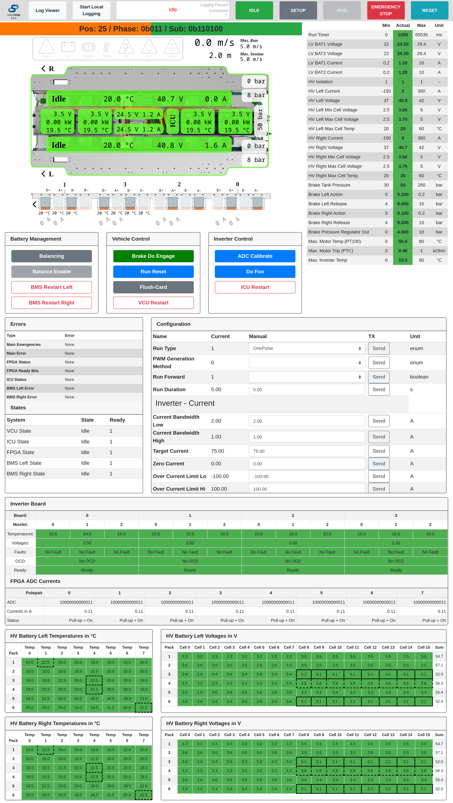

# Swissloop Control Panel •  

The control panel is a control and visualization software for the telemetry data of Swissloop prototypes. The control panel is implemented as an [Electron](https://www.electronjs.org/) application with [Node.js](https://nodejs.org/en/) as it provides modularity, flexibility, and is easy to use.

**The most recent version is 3.0.0, developed during the Swissloop Season 2021/2022.**

<details>
<summary>Table of Content</summary>

- [Swissloop Control Panel •  ](#swissloop-control-panel---)
  - [Disclaimer](#disclaimer)
  - [About The Project](#about-the-project)
  - [Getting Started](#getting-started)
    - [Misc](#misc)
    - [Prerequisites](#prerequisites)
    - [Installation](#installation)
  - [Development](#development)
    - [Technical Documentation](#technical-documentation)
  - [Maintainer](#maintainer)
    - [Additional Contributors](#additional-contributors)
  - [Screenshot](#screenshot)
</details>

## Disclaimer
**Even though this software is open-source, and you are free to adapt everything to your need, we very much appreciate the credit to the original authors in the GUI. Hence, we kindly request you to not remove the *"Based on Swissloop Software"* comments in the code and GUI.**

**Furthermore, we would like to encourage the open exchange of ideas and technologies with the whole Hyperloop community and ask you to join us by making part of your solution to the problems publicly available.**

This software is by no means perfect and might still include some bugs or suboptimal code. Also, this software was developed specifically for our prototypes and should therefore be considered an implementation example rather than a finished framework. If you want to share some useful ideas and specific implementation details, don't hesitate to contact us. **However, we do not have the intention nor the resources to provide any support!**

## About The Project
The control panel is used to display the telemetry data of the pod, configure parameters and display logged data.
It provides a clear illustration of all relevant data with different approaches.
This includes a graphical representation of the prototype, overlaid with colors indicating the states of the subsystems and the most important values.
Further, a color-coded table is used to quickly spot non-nominal values.
Additionally, the error module, displaying all error messages, proved very helpful during testing and drastically increases efficiency.
Finally, the standalone mock server can be used to emulate packets from a virtual prototype to develop and test new features in the control panel.

## Getting Started

### Misc
* The control panel assumes statically assigned IP addresses and fixed ports. The configuration is specified in `control_panel/config/config.js`.
* **You can emit an emergency at all time by quickly hitting 2x Space!**

### Prerequisites

*Please update node to the newest version.* Please refer to https://nodejs.org/en/  

For Arch base Linux systems run:
```bash
pacman -S nodejs npm
```
On Mac run:
```bash
brew install node
```
On Ubuntu run:
```sh
sudo apt update
sudo apt install nodejs npm
```

### Installation
Download the repository, install all required dependencies and start the application.
```bash
git clone git@github.com:swissloop/ControlPanel.git
cd ControlPanel
npm install
npm start
```

If required, you can automatically download the latest telemetry frame definitions from a GitHub repository and generate the parser for the binary stream.

```bash
npm run generate_parser
```

For this you need to configure API access to your GitHub repository containing the frame definition in `control_panel/config/config.js`.

* `telemetry_frame_src`: URL to network_telemetry_frame.h in the form of https://api.github.com/repos/{owner}/{repo}/contents/{path}

* `github_access_token`: Access token (fine-grained personal access tokens)

## Development

For testing without the VCU board, a mock server is included in the `mock_server` folder.
To use the mock server, change the "udp_host_send" field in `control_panel/config/config.js` to `127.0.0.1`

Run the following command to start the mock server.

```bash
npm run mock
```

There is also the possibility to generate and display random packets. This can be configured in `control_panel/config/config`.

Most of the time, it is also helpful to enable the *Developer Tools*. For this, go *Viev* ► *Toggle Developer Tools* in the application toolbar. Alternatively press *Ctrl+Shift+I*.

### Technical Documentation
For the technical documentation, please refer to [Technical.md](TECHNICAL.md).

## Maintainer
**Philip Wiese** (ETHZ ETIT, Main Contributor)  
  *[philip.wiese@swissloop.ch](mailto:philip.wiese@swissloop.ch)* - [Xeratec](https://github.com/Xeratec)  

### Additional Contributors
**Hanno Hiss** (ETHZ ETIT, Season 21/22)  
  *[hanno.hiss@swissloop.ch](mailto:hanno.hiss@swissloop.ch)* - [hannohiss](https://github.com/hannohiss)  

**Roger Barton** (ETHZ INF, Season 21/22)  
  *[roger.barton@swissloop.ch](mailto:roger.barton@swissloop.ch)* - [rogerbarton](https://github.com/rogerbarton)  

**Yvan Bosshard** (ETHZ ETIT, Season 20/21)  
  *[yvan.bosshard@swissloop.ch](mailto:yvan.bosshard@swissloop.ch)* - [yvanbo](https://github.com/yvanbo) 

## Screenshot
